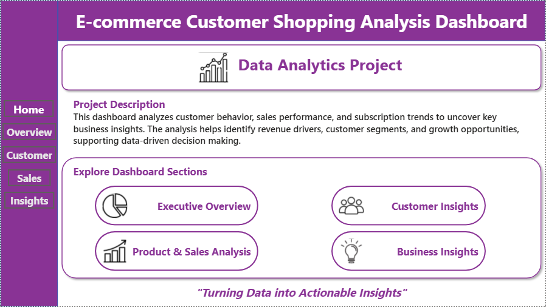
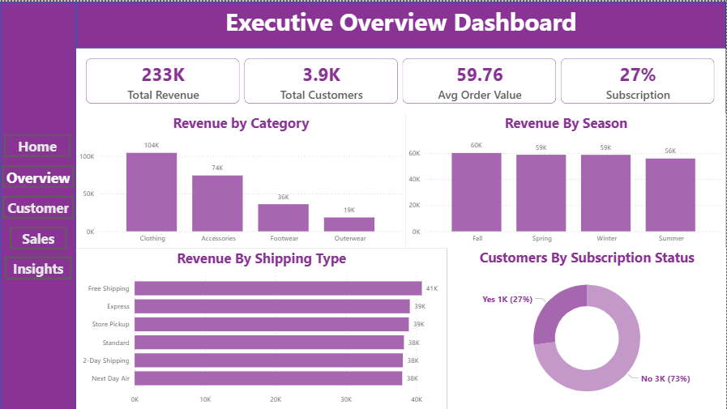
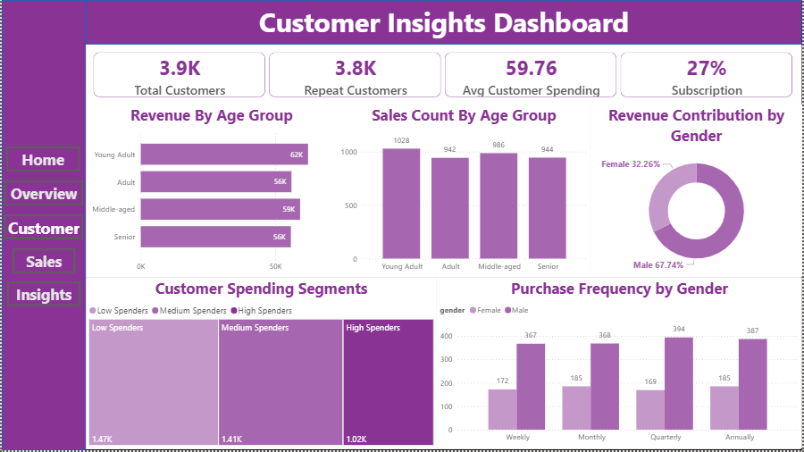
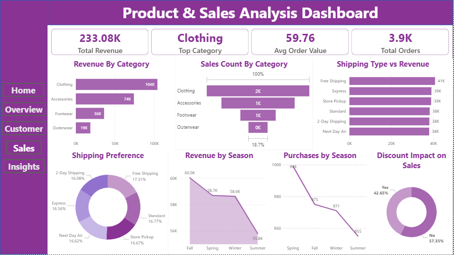
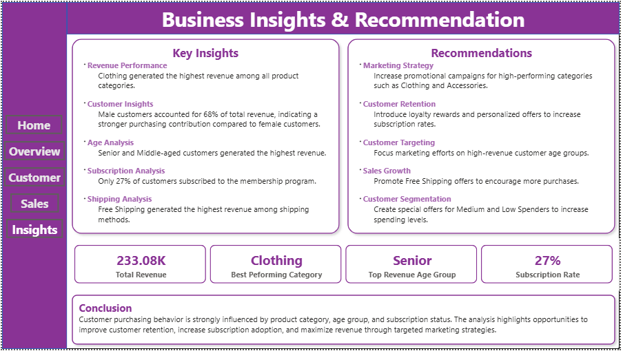

# E-Commerce Customer Shopping Analysis Dashboard

## Project Overview

The E-Commerce Customer Shopping Analysis Dashboard is a Business Intelligence project developed using Power BI to analyze customer purchasing behavior, sales performance, and subscription trends. The project transforms raw customer transaction data into meaningful insights that support data-driven decision-making and business growth.

## Problem Statement

Businesses generate large volumes of customer transaction data but often struggle to extract actionable insights. This project aims to identify customer segments, revenue drivers, purchasing patterns, and opportunities to improve customer engagement and sales performance.

## Tools & Technologies

* Power BI
* Python
* SQL
* Excel
* Pandas
* NumPy

## Dataset Information

* Dataset: Customer Shopping Behaviour Dataset
* Total Records: 3,900
* Features: Customer ID, Age, Gender, Category, Purchase Amount, Subscription Status, Shipping Type, Season, Review Rating, Previous Purchases, and more.

## Project Workflow

Data Collection → Data Cleaning & Preparation → Exploratory Data Analysis → SQL Analysis → KPI Development → Power BI Dashboard Creation → Business Insights & Recommendations

## Dashboard Pages

### Home Page

Project introduction and dashboard navigation.

### Executive Overview

* Total Revenue
* Total Customers
* Average Order Value
* Subscription Rate
* Revenue Analysis

### Customer Insights

* Revenue by Age Group
* Revenue by Gender
* Purchase Frequency Analysis
* Customer Segmentation

### Product & Sales Analysis

* Revenue by Category
* Sales Count by Category
* Shipping Analysis
* Seasonal Sales Trends
* Discount Impact Analysis

### Business Insights & Recommendations

* Key Findings
* Strategic Recommendations
* Project Summary

## Key Insights

* Clothing generated the highest revenue among all product categories.
* Male customers contributed 68% of total revenue.
* Senior and Middle-aged customers generated the highest revenue.
* Free Shipping contributed the highest revenue among shipping methods.
* Subscription adoption remained relatively low at 27%.

## Skills Demonstrated

* Data Cleaning & Transformation
* Exploratory Data Analysis (EDA)
* SQL Querying
* KPI Development
* Customer Segmentation
* Data Visualization
* Dashboard Design
* Business Intelligence Reporting

## Dashboard Preview

### Home Page

### Executive Overview

### Customer Insights

### Product & Sales Analysis

### Business Insights & Recommendations

## Project Outcome

Successfully developed an interactive Power BI dashboard that transformed customer transaction data into actionable business insights, helping identify customer behavior patterns, revenue drivers, and business growth opportunities.

## Author

Jai Mudgal

Final Year Computer Science Engineering Student

Aspiring Data Analyst

